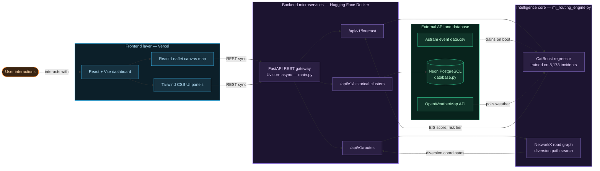

# EventPulse AI: Event-Driven Congestion Forecasting and Traffic Resource Optimization System

**Live demo:** https://event-driven-congestion-planned-unp.vercel.app/


**Keywords:** intelligent transportation systems (ITS), event impact scoring, gradient-boosted trees, time-series forecasting, geospatial routing, congestion prediction, decision support systems, OpenStreetMap, A* search, reproducible prototype.

---

## Abstract

Planned events such as festivals, rallies, and construction activity, alongside unplanned incidents such as breakdowns, accidents, and waterlogging, create localized bottlenecks that frequently escalate into city-wide congestion. Traffic authorities typically respond to these events reactively, deploying personnel and barricades based on experience rather than data. This repository implements **EventPulse AI**, an end-to-end prototype that

1. Ingests historical incident records from a curated dataset (8,173 entries) covering event cause, priority, road closure status, vehicle category, and spatial-temporal attributes;
2. Engineers spatial and temporal features — Geohash-6 encoding, cyclic time vectors, historical hotspot density, and corridor risk scores — from raw incident and road-network data;
3. Computes a unified **Event Impact Score (EIS)** per incident through a weighted combination of forecasted severity, delay, recovery time, and contextual risk factors, using a dual-model forecasting layer (CatBoost for point-in-time severity, Prophet for recurring temporal patterns);
4. Classifies each incident into a four-tier risk category and derives concrete operational recommendations — personnel counts and barricade units — from that classification;
5. Computes road-aware diversion routes using an OSMnx-extracted road network and an A* search implemented over NetworkX, with dynamic edge-masking for closed segments;
6. Augments the scoring pipeline with live weather conditions, escalating an incident's risk tier when it falls within an actively raining zone; and
7. Surfaces all of the above through a map-centric React dashboard with live incident visualization, a dedicated decision-support view, and historical analytics.

The system was designed and built end-to-end across a structured four-phase development cycle (brainstorming, requirements analysis, design and architecture, and implementation) within a 48-hour hackathon window, using a decoupled frontend-backend architecture to allow both halves of the system to be developed independently and in parallel.

---

## 1. Motivation and problem statement

Municipal traffic authorities currently lack pre-event visibility into how a given incident is likely to evolve. Three gaps in particular motivated this work:

1. **No predictive signal before escalation.** Authorities typically learn about an incident's severity only after congestion has already built up, leaving no window for proactive deployment.
2. **Experience-based, not data-based, resource allocation.** Manpower and barricade deployment decisions are made informally, without a consistent, auditable scoring mechanism behind them.
3. **No structured post-event learning loop.** Outcomes of past incidents (actual clearance time, actual personnel used) are rarely fed back into future decision-making.

EventPulse AI addresses these gaps by formalizing incident severity into a single computable score (the EIS), deriving deployment recommendations directly from that score, and providing the scaffolding — a feedback table in the schema — for outcomes to eventually retrain the model.

---

## 2. System architecture

### 2.1 Logical layers

The system is organized into seven sequential processing tiers, moving from raw event ingestion to operator-facing decision support:

- **Event source layer.** Historical incident logs (the ASTraM dataset) and, in future scope, external public event calendars.
- **Data collection and ingestion layer.** Standardizes inbound incident records and road network data pulled from OpenStreetMap via OSMnx.
- **Data processing and feature integration layer.** Validates and sanitizes raw records, then computes Geohash-6 indices, cyclic time-of-day features, resolution-duration targets, and running hotspot/corridor risk statistics.
- **Spatial intelligence and forecasting layer.** Runs a CatBoost regressor for point-prediction of severity, delay, and recovery duration, alongside a Prophet model for recurring temporal congestion patterns. A nearest-neighbor historical similarity engine provides additional context.
- **Event Impact Assessment layer (EIS engine).** Combines the above signals into a single weighted score and maps it to a risk tier.
- **Automated decision support layer.** Translates the risk tier into personnel and barricade recommendations, and computes diversion routing when a closure is in effect.
- **Application dashboard layer.** Renders all of the above as an interactive map, a decision-support console, and historical analytics views.

### 2.2 Architecture diagram



### 2.3 Design invariant

> The decision-support layer never recomputes the EIS independently. Every downstream consumer — personnel recommendation, barricade count, route weighting, dashboard risk badge — reads the same EIS value and risk tier computed once by the intelligence core, ensuring the entire system stays consistent with a single source of truth per incident.

---

## 3. Data sources

| Modality | Source | Role |
|---|---|---|
| Historical incidents | ASTraM dataset (8,173 records) | Event cause, priority, closure flag, corridor, vehicle type, timestamps |
| Road network | OpenStreetMap, via OSMnx | Edge vectors, junctions, and graph paths for routing |
| Live weather | OpenWeatherMap API | Per-corridor rain detection for EIS tier escalation |
| Planned events | Public event calendars | Future scope — not implemented in current prototype |

---

## 4. Methodology

### 4.1 Feature engineering

Each raw incident record is transformed before modeling:

- **Geohash-6 encoding** of latitude/longitude for spatial clustering and missing-zone imputation.
- **Cyclic time encoding** of the incident start time via $\sin(\text{hour})$ and $\cos(\text{hour})$, preserving the circular nature of time-of-day.
- **Resolution delta**, computed as $\text{Resolved Time} - \text{Start Time}$, used as a regression target for recovery-time prediction.
- **Historical hotspot score**, a running density of past incidents within a geohash cell.
- **Corridor risk score**, capturing cascading vulnerability along major arterial corridors.

### 4.2 Event Impact Score

The EIS compresses six weighted factors into a single operational score:

```
EIS = 0.35 * SeverityScore + 0.20 * DelayScore + 0.15 * RecoveryScore
    + 0.15 * HotspotScore + 0.10 * CorridorRisk + 0.05 * HistoricalSimilarity
```

The resulting score in $[0, 100]$ is mapped to a four-tier risk classification:

| EIS range | Risk tier | Response |
|---|---|---|
| 0 – 30 | Low | Passive logging, routine tracking |
| 31 – 60 | Medium | Dashboard alert, alternate paths prepared |
| 61 – 80 | High | Active dispatch alerts, field personnel deployed |
| 81 – 100 | Critical | Emergency state, forced rerouting, junction lockdown |

### 4.3 Decision support mapping

Personnel and barricade recommendations are derived directly from the risk tier, rather than tracking live equipment inventory — the system is a recommendation engine, not an asset-tracking tool:

| Risk tier | Personnel target | Closure scenario | Barricades required |
|---|---|---|---|
| Low | 2 officers | No closure | 0 |
| Medium | 5 officers | Partial lane block | 2 – 4 |
| High | 8 officers | — | — |
| Critical | 12+ officers, command unit | Full segment closure | 5 – 8 |

### 4.4 Diversion routing

Road-aware alternate paths are computed using an A* search over a NetworkX graph extracted from OpenStreetMap via OSMnx, using Great-Circle Haversine distance as the heuristic. When an incident's `requires_road_closure` flag is true, the corresponding edge's capacity is dropped to zero before the search runs, preventing the pathfinder from routing through the blocked segment.

### 4.5 Weather-driven risk escalation

Each monitored corridor is checked against live conditions from the OpenWeatherMap API. If the returned condition falls within a defined rain set (rain, drizzle, thunderstorm), any incident located within that corridor has its risk tier escalated by exactly one level, reflecting the added congestion risk that precipitation introduces, without altering the underlying EIS computation itself.

---

## 5. Application layer

| Component | Library | Purpose |
|---|---|---|
| Spatial map | React-Leaflet | Incident markers, congestion heatmap, diversion route overlay |
| Decision console | React + Tailwind | Per-incident personnel/barricade recommendation and dispatch tracking |
| Analytics | Plotly | Corridor breakdown, EIS trend, severity distribution |
| Live alerts | React (polling) | Escalating alert feed reflecting current risk state |

The frontend was developed against a strict mock-API contract from the first day of implementation — every screen was built and made fully interactive against hand-written JSON fixtures shaped exactly like the planned FastAPI responses, which let the UI reach completion independently of the model and routing pipeline's development timeline.

---

## 6. Infrastructure

| Component | Technology | Notes |
|---|---|---|
| API gateway | FastAPI (Python), Uvicorn | Asynchronous REST endpoints |
| Forecasting | CatBoost, Prophet | Dual-model severity and temporal prediction |
| Routing | OSMnx, NetworkX | Road graph extraction and A* search |
| Database | Neon serverless PostgreSQL + PostGIS | Incident, prediction, recommendation, and feedback tables |
| Cache | Upstash Redis | Route and prediction caching to reduce repeated computation |
| Hosting | Hugging Face Spaces (backend), Vercel (frontend) | Free-tier deployment targets |
| Uptime | cron-job.org | Periodic keep-alive ping against free-tier sleep limits |

---

## 7. API surface

| Method | Endpoint | Input | Output |
|---|---|---|---|
| POST | `/predict` | Incident parameters and spatial point | EIS, risk tier, forecast targets |
| POST | `/recommend` | EIS and closure flag | Personnel and barricade counts |
| POST | `/route` | Origin/destination geohash, blocked edges | Diversion path coordinates |
| GET | `/dashboard` | — | Aggregated active incidents and congestion grid |
| GET | `/weather` | — | Per-corridor live rain status |
| POST | `/feedback` | Actual field clearance data | Acknowledgement, logged for retraining |

---

## 8. Database schema

| Table | Contents |
|---|---|
| `incidents` | Raw inbound tracking parameters, verified coordinates, classification flags |
| `predictions` | Computed severity, delay, recovery targets, and final EIS |
| `recommendations` | Personnel counts, barricade configurations, route paths |
| `feedback` | Realized field clearance time and officer count, for closed-loop retraining |

---

## 9. Reproduction steps

```
# 1. Clone and configure
git clone https://github.com/<your-username>/eventpulse-ai.git
cd eventpulse-ai

# 2. Backend setup
cd traffic-backend
python -m venv venv
source venv/bin/activate              # Windows: venv\Scripts\activate
pip install -r requirements.txt
cp .env.example .env                  # add DATABASE_URL, UPSTASH credentials, OPENWEATHER_API_KEY

# 3. Download the road network graph (one-time, ~3-5 minutes)
python download_graph.py

# 4. Run the backend
uvicorn main:app --reload             # http://localhost:8000/docs

# 5. Frontend setup (separate terminal)
cd ../traffic-frontend
npm install
npm run dev                           # http://localhost:5173
```

---

## 10. Repository layout

```
eventpulse-ai/
├── traffic-backend/
│   ├── main.py                       FastAPI app, route registration, CORS, DB connection
│   ├── ml_routing_engine.py          CatBoost training on boot + NetworkX diversion search
│   ├── data_engine.py                Rule-based EIS and resource allocation logic
│   ├── database.py                   Neon PostgreSQL connection and queries
│   ├── Astram event data.csv         Historical incident dataset (8,173 records)
│   ├── catboost_info/                Training logs, auto-generated on each run
│   ├── requirements.txt
│   └── Dockerfile                    Hugging Face Spaces deployment
│
├── traffic-frontend/
│   ├── index.html
│   ├── vite.config.js
│   ├── package.json
│   ├── public/
│   │   ├── favicon.svg
│   │   └── icons.svg
│   └── src/
│       ├── App.jsx                   Root layout and routing
│       ├── main.jsx                  Entry point
│       ├── index.css
│       ├── assets/
│       │   └── hero.png
│       ├── components/
│       │   ├── Sidebar.jsx           Navigation
│       │   ├── TrafficMap.jsx        Base Leaflet map
│       │   ├── MapView.jsx           Full map screen with layer toggles
│       │   ├── HeatmapLayer.jsx      Congestion density overlay
│       │   ├── RouteOverlay.jsx      Diversion path rendering
│       │   ├── EISGauge.jsx          Risk score gauge component
│       │   ├── IncidentCard.jsx      Decision-support incident card
│       │   ├── IncidentTable.jsx     Dashboard lookup table
│       │   └── AlertBanner.jsx       Critical alert strip
│       └── services/
│           ├── api.js                API client, mock/live switch
│           └── mocks/                JSON fixtures used during parallel development
│               ├── dashboard.json
│               ├── predict.json
│               ├── route.json
│               └── routes.json
│
├── .gitignore
└── README.md
```

---

## 11. Evaluation and validity

| Aspect | What to report |
|---|---|
| Forecasting accuracy | CatBoost regression error against held-out incidents; Prophet fit against historical time series |
| EIS calibration | Distribution of computed scores against the four-tier boundaries, checked for reasonable tier balance |
| Routing correctness | Verification that closed-edge incidents never appear in returned diversion paths |
| Recommendation consistency | Cross-check that personnel/barricade counts always match the documented tier mapping |

**Threats to validity.** The personnel and barricade mapping is a fixed rule table rather than one calibrated against real traffic-police deployment data; the historical similarity engine operates on a single dataset without external validation; weather-driven escalation is a single-tier upgrade rather than a continuously scaled penalty; the road graph and routing logic are scoped to Bengaluru and have not been tested against other cities.

---

## 12. Limitations and future work

- **Personnel and barricade calibration.** The current deployment-target table is a defensible starting heuristic, not one derived from real traffic-authority staffing data. A production rollout would calibrate it against actual municipal deployment records.
- **Citizen reporting.** A mobile or web-based citizen reporter module to support crowd-sourced incident validation is scoped but not implemented in the current prototype.
- **Computer vision ingestion.** The complete conceptual architecture includes live CCTV-based incident detection; the current prototype focuses on proving out the prediction, scoring, and routing logic against the available historical dataset, with vision-based ingestion scoped as a clearly separated next step given hackathon time and CPU-only infrastructure constraints.
- **Closed-loop retraining.** The feedback table exists in the schema, but automated retraining of the CatBoost model against logged outcomes is not yet wired up.
- **Weather granularity.** Risk escalation currently applies a flat one-tier upgrade; a more refined approach would scale the EIS penalty continuously with rainfall intensity rather than as a step function.

---

## 13. Project background

This system was developed across a structured four-phase software development lifecycle:

1. **Brainstorming and goal-setting** — problem framing and the original conception of the Event Impact Score as the system's central organizing idea.
2. **Requirements analysis and planning** — dataset analysis, feature engineering decisions, functional and non-functional requirements, and technology stack selection.
3. **Design and architecture** — translation of those requirements into the seven-layer system design described in Section 2.
4. **Implementation** — a three-day build executed as two parallel, independently developed tracks (frontend and backend), integrated on the final day against a pre-agreed mock API contract.
